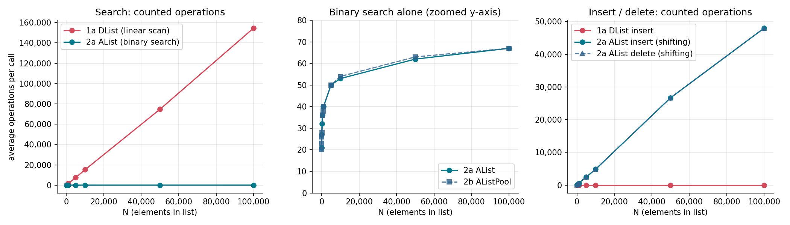
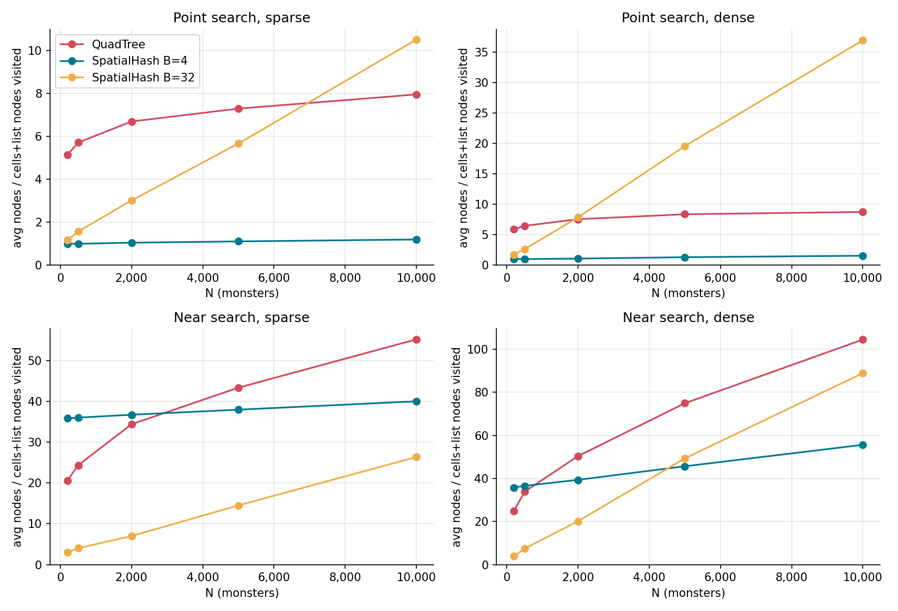
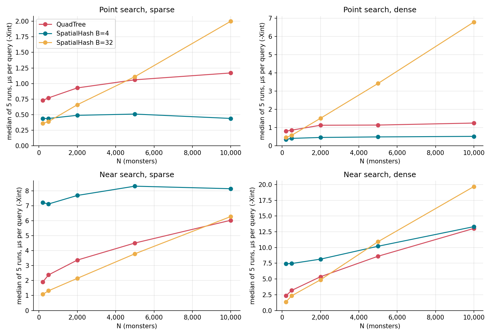

# Java Data Structure Benchmarks

Two data-structure projects written in Java for **Data Structures & Algorithms** at the
Technical University of Crete (School of ECE), spring 2025. Each project implements several
structures behind a common interface, then benchmarks them by counting elementary work
(operations or node/cell accesses) and measuring wall-clock time.

| | Project | Structures compared | Workload |
|---|---|---|---|
| 1 | [List implementations](#project-1--list-implementations) | Linked list vs. sorted array, each with and without an object pool | Search, insert, delete on N = 30 … 100,000 keys |
| 2 | [Spatial structures](#project-2--spatial-structures) | Point-region QuadTree vs. spatial hashing (B = 4 and B = 32) | Point and "near" queries on 200 … 10,000 monsters in a 1024 × 1024 world |

All metrics below were produced by running the code in this repository with OpenJDK 21 and
`-Xint` (JIT disabled, as the assignments require). Operation and access counts are
properties of the code; timings depend on the machine.

---

## Project 1 — List implementations

### Implementations

| ID | Class | Storage | Object pool |
|---|---|---|---|
| 1a | `DList` | Singly linked list with head and tail pointers; inserts append at the tail | — |
| 1b | `DListPool` | Same as 1a | `DObjectPool`: deleted nodes are queued and reused by later inserts |
| 2a | `AList` | Fixed-capacity array kept sorted by key; binary search for every operation, shifting on insert/delete | — |
| 2b | `AListPool` | Same as 2a | `AObjectPool`: array-backed stack of deleted elements |

All four implement `org.tuc.List` (`insert`, `delete`, `search` on non-unique `int` keys with a
50-character payload). Every comparison and assignment increments a global counter
(`Globals.numOfCommands`), including the work done inside the object pools.

### Experiment

For each N, the program loads `data_N.bin` into all four structures and then runs K random
operations of each kind, in the order the assignment prescribes: **A** search, **B** insert,
**C** delete, **D** insert again (K = 10, 50 or 100 depending on N). It reports the average
operation count and time per call.

### Theoretical complexity

| | 1a `DList` | 1b `DListPool` | 2a `AList` | 2b `AListPool` |
|---|---|---|---|---|
| `insert` | O(1) | O(1) | O(n) | O(n) |
| `delete` | O(n) | O(n) | O(n) | O(n) |
| `search` | O(n) | O(n) | O(log n) | O(log n) |

The sorted array pays O(log n) to find a position but O(n) to shift elements, so only search
benefits from binary search.

### Results



Average counted operations per call:

| N | Search 1a | Search 2a | Insert 1a | Insert 2a | Delete 1a | Delete 2a |
|---:|---:|---:|---:|---:|---:|---:|
| 100 | 160 | 27 | 7 | 94 | 175 | 91 |
| 1,000 | 1,556 | 40 | 7 | 584 | 1,433 | 579 |
| 10,000 | 15,223 | 53 | 7 | 4,871 | 14,549 | 4,869 |
| 100,000 | 154,602 | 67 | 7 | 47,983 | 151,687 | 47,976 |

Average time per call (µs):

| N | Search 1a | Search 2a | Delete 1a | Delete 2a |
|---:|---:|---:|---:|---:|
| 100 | 3.7 | 1.3 | 4.1 | 3.0 |
| 1,000 | 35.0 | 1.4 | 32.9 | 15.0 |
| 10,000 | 345 | 1.9 | 342 | 135 |
| 100,000 | 3,637 | 3.2 | 3,659 | 1,375 |

Effect of the object pool on insert (counted operations, constant across all N):

| | 1a `DList` | 1b `DListPool` |
|---|---:|---:|
| Step B: pool still empty | 7 | 9 |
| Step D: pool filled by step C's deletes | 7 | 14 |

### Findings

The measurements line up with the theory. Linear search costs about 1.5 N operations because
roughly half of the random keys (drawn from 1 … 2N) are absent and force a full scan, while
binary search grows only from 21 to 67 operations between N = 30 and N = 100,000, which is about four
counted operations per halving step. Sorted-array insert and delete both shift about N/2
elements on average, so their curves sit on top of each other.

Under `-Xint`, time tracks the operation count closely for large N: roughly 23 ns per counted
operation for linked-list search and 29 ns for array shifting.

The pool makes an insert *more* expensive in counted operations (14 vs. 7) because recycling
a node involves queue bookkeeping. Its benefit is avoiding allocation and garbage collection,
which an operation count cannot show.

The ten lookups for N = 100,000 spell out: *"Without data structures, life is just a heap of
problems"*.

---

## Project 2 — Spatial structures

### Structures

Monsters live on integer coordinates in a K × K world (K = 1024), at most one per coordinate.
Both structures implement `SpatialStructure` (`insert`, `search`, `rangeSearch`,
`findNearPoints`). A "near" query returns every monster within ±D = 10 on both axes, which
becomes a 21 × 21 `rangeSearch`.

`QuadTree` is a point-region quadtree. Each node stores its inclusive bounds. A leaf holds at
most one monster and splits into NW/NE/SW/SE children when a second one arrives. Insert, search
and range search are recursive, and range search prunes quadrants that don't overlap the query
box.

`SpatialHash` divides the world into B × B buckets stored in a flat array of lists, indexed by
`(y / B) · (K / B) + x / B`. Two instances are benchmarked: B = 4 (65,536 buckets) and
B = 32 (1,024 buckets).

Accesses are counted as nodes entered for the QuadTree, and as buckets visited plus list
entries examined for the hash tables.

### Datasets

| | Monster placement | N |
|---|---|---|
| Sparse | Uniform over the whole world | 200, 500, 2,000, 5,000, 10,000 |
| Dense | Uniform over x, y ∈ [500, 1023] (about 26 % of the world) | same |

Each dataset comes with 100 point queries and 100 near-query centres.

### Results



Average accesses per query, **sparse** data (S = point search, R = near search):

| N | S1 QuadTree | S2 Hash B=4 | S3 Hash B=32 | R1 QuadTree | R2 Hash B=4 | R3 Hash B=32 |
|---:|---:|---:|---:|---:|---:|---:|
| 200 | 5.14 | 1.00 | 1.18 | 20.60 | 35.82 | 3.05 |
| 500 | 5.72 | 1.00 | 1.57 | 24.36 | 36.02 | 4.02 |
| 2,000 | 6.70 | 1.05 | 3.02 | 34.40 | 36.73 | 7.00 |
| 5,000 | 7.30 | 1.11 | 5.67 | 43.36 | 37.97 | 14.51 |
| 10,000 | 7.96 | 1.20 | 10.52 | 55.20 | 40.02 | 26.37 |

Average accesses per query, **dense** data:

| N | S1 QuadTree | S2 Hash B=4 | S3 Hash B=32 | R1 QuadTree | R2 Hash B=4 | R3 Hash B=32 |
|---:|---:|---:|---:|---:|---:|---:|
| 200 | 5.92 | 1.03 | 1.76 | 24.96 | 35.79 | 3.94 |
| 500 | 6.48 | 1.01 | 2.65 | 33.84 | 36.55 | 7.42 |
| 2,000 | 7.57 | 1.09 | 7.88 | 50.36 | 39.33 | 20.17 |
| 5,000 | 8.38 | 1.32 | 19.59 | 74.88 | 45.63 | 49.31 |
| 10,000 | 8.76 | 1.56 | 36.99 | 104.44 | 55.59 | 88.85 |



Time per query at N = 10,000 (µs, median of 5 runs):

| Data | S1 QuadTree | S2 Hash B=4 | S3 Hash B=32 | R1 QuadTree | R2 Hash B=4 | R3 Hash B=32 |
|---|---:|---:|---:|---:|---:|---:|
| Sparse | 1.17 | 0.44 | 2.00 | 6.03 | 8.14 | 6.28 |
| Dense | 1.25 | 0.52 | 6.79 | 13.03 | 13.31 | 19.68 |

Structure shape, computed from the datasets:

| Data | N | QuadTree height | Longest bucket, B=4 | Longest bucket, B=32 |
|---|---:|---:|---:|---:|
| Sparse | 200 | 7 | 1 | 2 |
| Sparse | 2,000 | 10 | 3 | 7 |
| Sparse | 10,000 | 10 | 4 | 21 |
| Dense | 200 | 8 | 1 | 4 |
| Dense | 2,000 | 10 | 3 | 16 |
| Dense | 10,000 | 10 | 5 | 52 |

### Findings

**Point search.** The B = 4 hash is effectively constant-time: one bucket plus a bucket that
can never hold more than B² = 16 monsters, and in practice holds at most 5. It is the fastest
point search at every N, at about 0.5 µs. The QuadTree's cost is also bounded. Each split halves
the region side, so the height can't exceed log₂ 1024 = 10, and the trees already reach that cap
at N = 2,000. A point search therefore never visits more than 11 nodes, however many monsters are
added. The B = 32 hash degrades **linearly** with N, because its expected bucket length is
N · B² / area. Nearly all benchmark point queries are misses, so the whole bucket is scanned:
on dense data at N = 10,000 that is 1 bucket plus about 10,000 / 289 occupied buckets ≈ 35
entries, which matches the measured 36.99.

**Near search.** With B = 4, a 21 × 21 box overlaps 36–49 buckets (fewer at the world's edge),
even when they are empty. That gives R2 a high fixed cost: about 36 accesses and 7 µs already at N = 200. With
B = 32 the box touches only 1–4 buckets, but every monster in them must be checked, so the cost
grows with density. The QuadTree prunes whole quadrants and is the most balanced option.
It is competitive on sparse data and ties for fastest on dense data at N = 10,000.

**Accesses vs. time.** The two metrics diverge when accesses aren't equally expensive. For R2,
most accesses are visits to empty buckets (each one creates a list iterator), so at small N its
time is out of proportion to its access count.

**Correctness.** For the dense N = 10,000 set, all three structures return the monsters listed
in `00_demo_data.txt` for the six point lookups and the same eleven monsters near (900, 688).
Every benchmark query (2,000 queries across the ten datasets, each run on all three structures)
also matches a brute-force scan.

---

## Building and running

Requires JDK 17 or newer. Both programs read their data files through relative paths, so run
each one from its own project folder. The course datasets must be present (`data_N.bin` in
`project_1/`; `monsters_*`, `single_search_*` and `near_search_*` files in `project_2/src/`).

```bash
# Project 1
cd project_1
javac -d out $(find src -name "*.java")
java -Xint -cp out org.Main

# Project 2
cd project_2
javac -d out $(find src -name "*.java")
java -Xint -cp out org.tuc.spatial.Main
```

In IntelliJ IDEA or Eclipse, add `-Xint` to the run configuration's VM options and set the
working directory to the project folder.

## Repository layout

```
project_1/
  src/org/tuc/     Interfaces from the assignment (Element, List, ObjectPool)
  src/org/         DList, DListPool, AList, AListPool, the two object pools, Main
project_2/
  src/org/tuc/spatial/          TucPoint, Monster, SpatialStructure, QuadTree, SpatialHash, Main
  src/org/tuc/spatial/tests/    BenchmarkRunner (experiment and validation)
  src/org/tuc/spatial/util/     AccessCounter, FileReader
docs/
  img/             Charts used in this README
  reports/         Original reports (Greek)
```

## Known issues

- `DListPool` and `DObjectPool` don't clear a recycled node's `next` pointer, so reusing a node
  can create a cycle in the list. The benchmark doesn't traverse the list after its last insert
  round, so the published numbers are unaffected.
- `AObjectPool.hasFreeObject()` checks slot 0 instead of the stack size, so it reports free
  objects after the pool has been emptied.
- Project 1's insert timings include random-string generation inside the timed loop, which
  dominates the measurement. Insert timings are therefore not reported above.
- Project 2's program labels its time table "ms"; the values are microseconds.

## Authors

- **Eirini Doulaveri** ([@iribiriee](https://github.com/iribiriee))
- **Giorgos Karavangelis**
